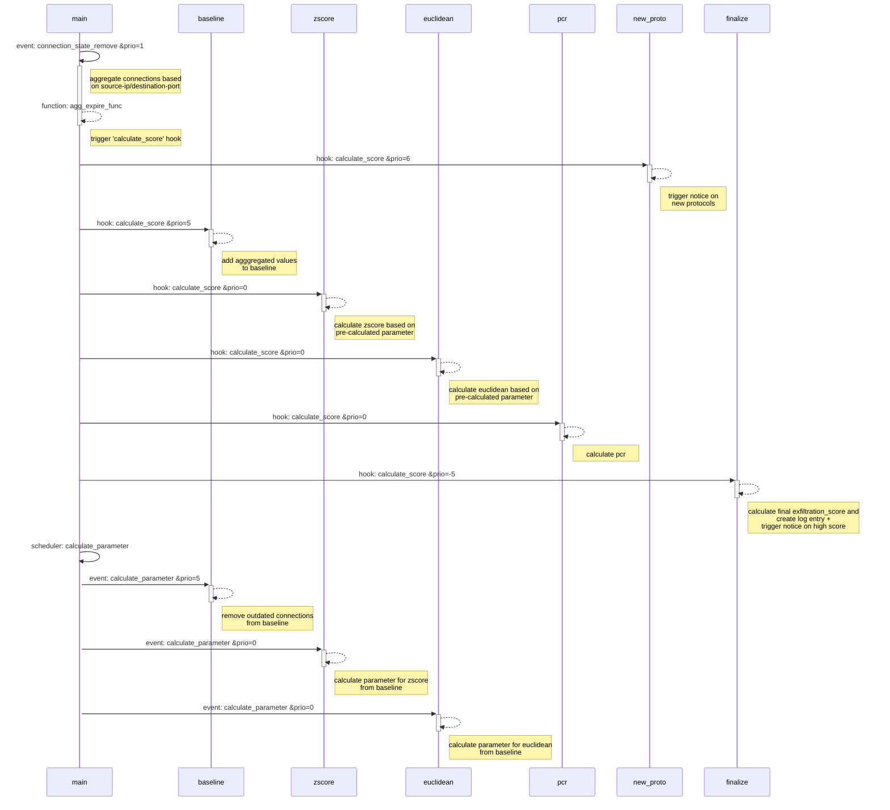

# Exfiltration::exfil_detect

This Zeek package provides the possibility to detect exfiltration through statistical analysis methods.


## detection hypothesis

The approach is based on the hypothesis that the network behavior of a data exfiltration differs significantly from normal connections. 
* A data exfiltration is performed in an outgoing network connection.
* A data exfiltration is characterized by a larger volume of sent data than received data within a connection.
* A data exfiltration differs from normal connections within a network protocol in the number of bytes transmitted.

Nevertheless, during the execution of an attack, it is also possible to perform data exfiltration through incoming network connections. 
Furthermore, the theft of passwords, credit card information, or other relatively small amounts of data can also be considered exfiltration.
However, this type exfiltration is more likely to be in the detection area of command and control traffic or advanced persistent threats.
<br>

**The detection approach used here refers primarily to the detection of data exfiltration in the range of gigabytes, such as is carried out**
**in the context of a ransomware attack.**


## how the detection works

First, parameters such as the source and destination IP addresses/ports and the number of bytes transferred are extracted from the network connections 
and stored as the data basis. By classifying the connection by source IP address and destination port, it is possible to obtain a baseline of the 
network behavior as accurately as possible. The default length of the baseline is 14 days.
<br>

In addition, all incoming connections are summarized over a configurable period of time (default is 3 hours) before being added to the baseline. 
The aggregation allows on the one hand to reduce the size of the baseline, but also to detect distributed exfiltrations (e.g. different IP addresses for the same domain). 
The indicators of the aggregation can be chosen freely. The following parameters are set by default.
* destination ip adress
* domain name
* ja3s fingerprint (if installed)
<br>

After recording the connections, statistical algorithms are applied to detect anomalies. In the current state of development these include the application of the
* modified z-score via the number of bytes sent
* producer-consumer ratio of the bytes sent and received
* euclidean distance between the bytes send and the connection duration.
<br>

Detected anomalies, are an indicator of a deviation of the connections from normal and are interpreted as exfiltration attempts.
To be able to combine several scores, they are normalized into the range of [0, 1]. 
* For scores with a defined minimum and maximum (e.g. `pcr`), this is done by a simple min/max normalization. 
* For non-linear scores (e.g. `z-score`), the modified tanh-estimator is used.
* normalized negative values are replaced by 0, this removes the unnecessary range between [-1, 0] and keeps the score granularity.
<br>

After normalization, all algorithms used provide a standardized score between 0 and 1, which indicates the severity of the detected anomaly. 
Here, 0 stands for no anomaly and 1 is the maximum possible deviation. 
In a final step, all individual values are combined into an overall value, the `exfiltration_score`. 
All calculated scores of the connections are logged in the log `exfil_detection`. 
In addition, a notice log entry is created when a certain threshold value of the `exfiltration_score` (default is 0.8) is reached.

Due to the modularity of the plugin, it is possible to add further scores. 
<br>

Another function offered by the baseline is the detection of new protocols of a host. After the baseline has been created successfully, all detected 
protocols are compared with it. As soon as a previously unknown protocol is detected, a notice log entry is created.


## limitations

* Due to the multiple aggregation of the individual connections via different parameters (destination ip address, domain name and ja3s fingerprint), connections of a data exfiltration can be marked multiple times.
* The quality of the detection of data exfiltrations via the individual protocols depends heavily on their specific use within the respective network.
* Depending on the size of the network and the data to be analyzed, the performance of Zeek can be influenced.


---

## Settings

```coffee

## define the maximal hold time for a baseline or parameter element
const max_baseline_hold_time: interval = 30day &redef;

## define the time inveral in which new parameters are calculated for the individual score
## e.g. the median/MAD for the modified zscore
const new_calculation_window: interval = 1hr &redef;

## define the time interval in which multiple connections are aggregated (based on various indicators)
## before being appended to the baseline
## .. note:: for possible aggregation indicators see `enabled_indicators`
## .. :zeek:see: `enabled_indicators`
const aggregation_interval: interval = 3hr &redef;

## define the number of days to be recoreded in the baseline
const baseline_days: count = 14 &redef;

## keep baseline persistent across zeek restarts
## .. :zeek:see: `connections_baseline`
const connections_baseline_persistent: bool = T &redef;

## define path for sqlite database to store connections_baseline across zeek restarts
## .. :zeek:see: `connections_baseline`, `connections_baseline_persistent`
const connections_baseline_persistent_sqlite_path: string = "/tmp/zeek_persistent_baseline" &redef;

## define the minimum number of days with connections before the score are to be calculated using the baseline
const baseline_min_days_for_score: count = 10 &redef;

## define which indicators should be used for the aggregation of the connections.
## if multiple indicators are used, aggregations is performed for all of them individually.
## possible indicators are `resp_h`, `domain` and `ja3s`
## .. :zeek:see: `aggregation_interval`, `get_identifier`
const enabled_identifier: set[string] = set("resp_h", "domain", "ja3s") &redef;

## define the multicast address range which are excluded from the calcualtion of the scores
const multicast_address_range: set[subnet] = set(224.0.0.0/4, [ff00::]/8) &redef;

## define the threshold above which score a notice should be triggered
const threshold_raise_notice_at_high_score: double = 0.8 &redef;

```

<br>


## Plugin structure

### Topology




### Baseline data structure

The baseline is stored in the data structure `connections_baseline`. This contains the aggregated connection 
information (adjustable by `aggregation_interval`) of the individual connections.

The data structure subdivides in the first level into `source ip address` and `destination port` to allow 
individual baselines over these combinations.

On the second level, the data structure subdivides the days on which connections were made. This allows for 
easy removal of outdated values as well as a check on how many days the baseline contains.
<br>
**Note** that the information of the individual days must be aggregated before calculating different indicators.

At the last level, the data structure contains the values of the individual aggregated connection in a vector. 
The values of the connections are stored in the data structure of the `element`.

```coffee

# data structure for a single (aggregated) connection
type element: record {
    orig_ip_bytes: count;
    resp_ip_bytes: count;
    duration: interval;
    uid: vector of string &optional;
    identifier: string &optional;
};

# overall data structure for the baseline
# this structure subdivides into [orig_h, resp_p] as well as the different [dates] of monitoring
connections_baseline: table[addr, port] of table[time] of vector of element;

```


### Events/Hooks

```coffee

## the event is used to calculate parameters for individual scores over the baseline. 
## using the zscore as an example, the median and mad are calculated here.
## the event is also used to determine and adjust the size of the baseline.
## The event is executed in periodic intervals based on the `new_calculation_window` time.
## .. :zeek:see: `new_calculation_window`
event calculate_parametes();

## the hook is triggered as soon as an element has finished the time for aggregating of the connections. 
## the hook adds the corresponding element to the baseline and calculates the scores. 
## finally, the calculated scores are aggregated and the log entry is created
## .. :zeek:see: `agg_expire_func`
hook calculate_score(t: table[addr, port, string] of element, a: addr, p: port, s: string, le: logging_element)

```


### further customization

If additional information from the connection record is required for the development of further scores, this must be adapted 
manually in the `main.zeek` script. There is currently no modular solution for this use case. see the `connection_state_remove` 
event in `main.zeek`.

<br>
Further parameters for the aggregation of the individual connections can be defined via the hook `get_identifier`.

<br>
Further information to the log entry can be added by adjusting the `logging_element` record.


---

## notes to the development

The project was implemented in the course of a bachelor thesis. 
All developments took place in a test environment set up specifically for the project. 
Within this environment, legitimate activities and data exfiltrations were simulated.
